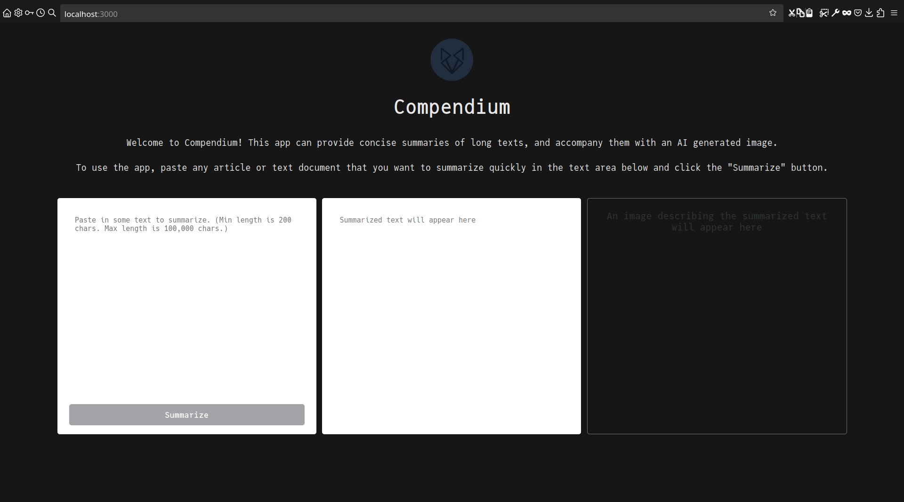

<div align="center">
<h1>⛰️Compendium v1.0</h1>

<div style="margin-right: 20px; display: inline-block;">
    
</div>

<div style="margin-right: 20px; display: inline-block;">
    
</div>

<div style="display: inline-block; margin-right: 20px;">
    
</div>

A text-summarizing and text-to-image converting web application powered by the
APIs at [Hugging Face](https://huggingface.co/) and NodeJS



Current version : 1.0

Project done for the completion of the Postman API certification course.

</div>

---

# Usage

After cloning the repository, run the following command in the CWD containing
`package-lock.json`:

```zsh
yarn install
```

Then create a `.env` file with the following contents:

```env
PORT=<integer>
API_KEY=<string>
```

(using your [Hugging Face Inference API Key](https://huggingface.co/docs/api-inference/index))

Then, to start the app, run:

```zsh
npm run dev
```

and visit `localhost:<PORT>/`

## Note

The app uses
[facebook's bart-large-cnn model] (<https://huggingface.co/facebook/bart-large-cnn>)
for the summary text generation and [stabilityai's SDXL model](https://huggingface.co/stabilityai/stable-diffusion-xl-base-1.0)
for the image generation. The SDXL server often crashes, so the image generation
does not always work (the blobs generated from the image buffers get corrupted).

Additionally, here are some sample text prompts that can be used for testing:

```text
Servers play a vital role in modern digital infrastructure. They are specialized
computers designed to store, manage, and process data, applications, and 
services. Acting as central repositories, servers respond to requests from
client devices like computers, smartphones, or other servers over a network,
such as the internet.

These robust machines handle a diverse range of tasks. Web servers host websites,
serving web pages to users who access them through browsers. Application servers
manage and run software applications, facilitating their execution and ensuring
smooth performance. Database servers store and organize data, allowing efficient
retrieval and manipulation of information for various applications.
```

```text
Amelia, a curious astronomer, spotted a peculiar comet through her telescope. It
emitted a mesmerizing glow and seemed to change course. 
Determined to investigate, she built a spaceship. On her journey, she 
encountered cosmic wonders, yet the comet remained elusive. 
Finally, at the edge of the universe, she understood its secret: the comet was a
celestial guide, leading her to discover the boundless wonders within herself.
Grateful for the voyage, Amelia returned, sharing her newfound wisdom with the 
world, inspiring others to explore both the cosmos and the depths of their souls.
```

---

Project started on: 30/10/2023

(v1.0) First functional version completed on: 06/11/2023
