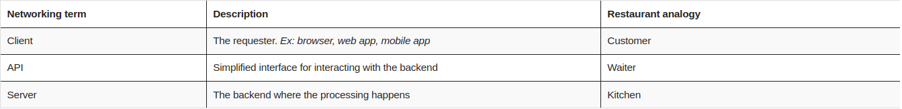
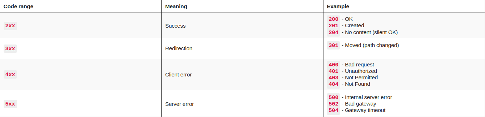

# API Fundamentals

## Section (1) - What are APIs

An API (Application Programming Interface) is a contract that enables code to
communicate with other code. They allow for the sharing of resources, and
services across applications, organizations and devices.

---

### Analogy with a restaurant

---
The term API can refer to a broad range of interfaces

* (1) Hardware APIs
    An interface for hardware to communicate with software
    Example: How the phone's camera communicates with the operating system

* (2) Software Library APIs
    Interface for directly consuming code from another code base
    Example: Using methods from a library that you import into your application

* (3) Web APIs
    Interface for communicating across code bases over a network
    Example: Fetching current stock prices from a finance API on the internet

---
Architectures for building and consuming APIs:

* REST (Representational State Transfer)
* GraphQL
* WebSockets
* Webhooks
* SOAP (Simple object access protocol)
* gRPC (Google remote procedural call)
* MQTT (MQ Telemetry Transport)

Out of these, REST APIs are the most widely adopted architecture. Some traits
include not storing session state between requests, the ability to cache, and the
ability to send and receive various data types.

APIs can further be public, private or partner

## Section (3) - Your first API request

Correct terminology: Make a request to `GET <url>`, etc.

Here `GET` is the request `METHOD` and `<url>` is the request `URL`

HTTP verbs: When you make a HTTP call to a server, we specify a request method
that indicates the type of operation we are about to perform. (These are also
called HTTP verbs)

The full list can be found [here](https://developer.mozilla.org/en-US/docs/Web/HTTP/Methods),
but most common HTTP verbs correspond to a CRUD (Create Read Update Delete) operation

---

### Request URL

In addition to a request method, a request must include a request URL, that indicates
where to make the API call.

A request URL has three parts. For example, with `https://library-api.postmanlabs.com/books`:

* The `PROTOCOL` : `http://` or `https://`
* The `HOST` (Location of the server) : `library-api.postmanlabs.com`
* The `PATH` (Route ON the server) : `/books`

Paths and complete URLs are sometimes called API endpoints.

---

### Response status codes

Status codes are indicators of whether a request failed or succeeded.

---

### Request - Response pattern

A representation of how computers communicate over a network. An API is the
interface that lets us know what kind of responses to expect
when we make calls to a server.

A `client` (browser, application, postman, etc) makes a `request` which is sent
to some server located at an address given by the request URLS `PROTOCOL` and `HOST`,
the request, (`METHOD` + `PATH`) is interpreted by the server, which sends an
appropriate `response` over the network back to the client

## Section (4) Request Parameters

Some APIs further allow you to refine your request further with key-value pairs called
`QUERY PARAMETERS`

---

### Query parameter syntax

Query parameters are added to the end of the path. They start with a `?` followed
by the key-value pairs in the format: `<key>=<value>`. If there are multiple
query parameters, they are separated by `&`

---

Another way of passing request data to an API is via `path variables`
(a.k.a `path parameters`). A path variable is a dynamic section of a path and is
often used for IDs and entity names such as usernames (this is API dependent)

---

### Path variable syntax

The path variable comes immediately after a slash in the path. So for example,
in the URL `https://api.github.com/users/{username}`, the path is `/users`, so
here `{username}` comes after a slash in the path and is the path variable

You can have multiple path variables in a request. For example: `/{username}/{repoName}`

---

The main difference between query parameters is that these accept dynamic values,
and are often used for IDs or entity names, while query parameters are often used
for options and filters.

Note: Some APIs use a `colon` syntax to represent a wildcard in the path like `/users/:username`,
instead of curly braces (`/users/{username}`). They both mean the same thing:
That part of the path is dynamic.

Example use: `{{baseUrl}}/books/:id` with id value `29cd820f-82f9-4b45-a7f4-0924111b5b89`
was `{{baseurl}}/books/29cd820f-82f9-4b45-a7f4-0924111b5b89`

## Section (5) Sending data with POST

You can make a `POST` request using a `JSON` body. You will need to send body
data with requests whenever you add or update structured data. Typically you will
use `JSON` body data with a `PUT`, `POST` and `PATCH` request.

Some APIs require Authorization (aka `Auth`) for certain endpoints in order to
permit a request. The reasons for an API requiring `Auth` is that having a
completely open endpoint that is public could allow unauthorized people access
to data they should not see, or bots to flood the server with several calls/s
shutting it down.

There are multiple methods for authorizing a request. Some examples are
`Basic Auth` (username + password), `OAuth` (delegated authorization) and
`API Keys` (secret strings registered to a developer from an API portal)

`Headers` are how we can add `Metadata` about our requests. such as authorization
information or specify the data type we want to receive in a response. This is
different than the actual payload data we send in the body of a request.
